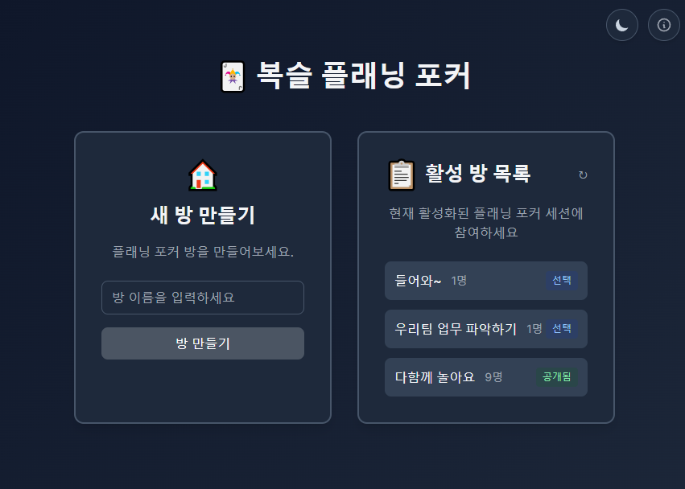
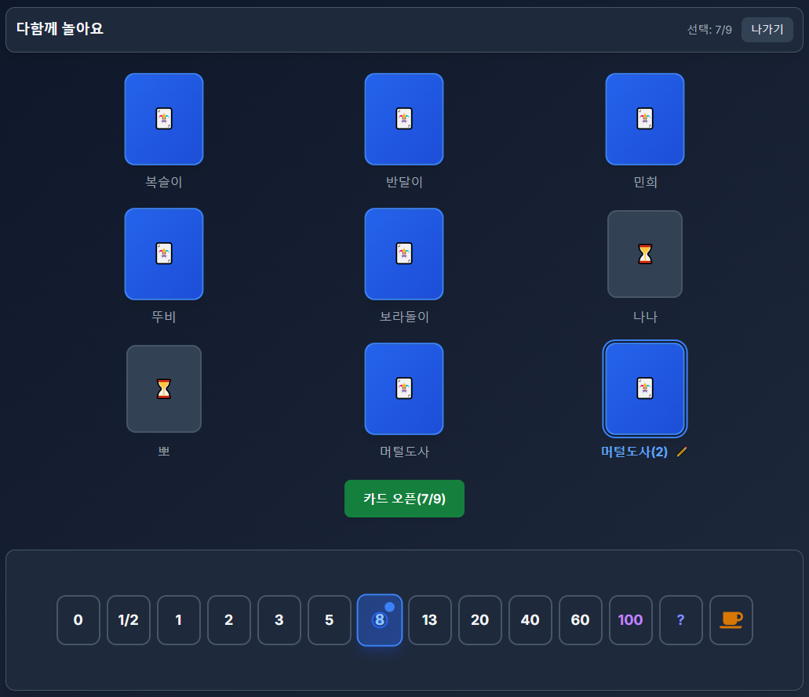
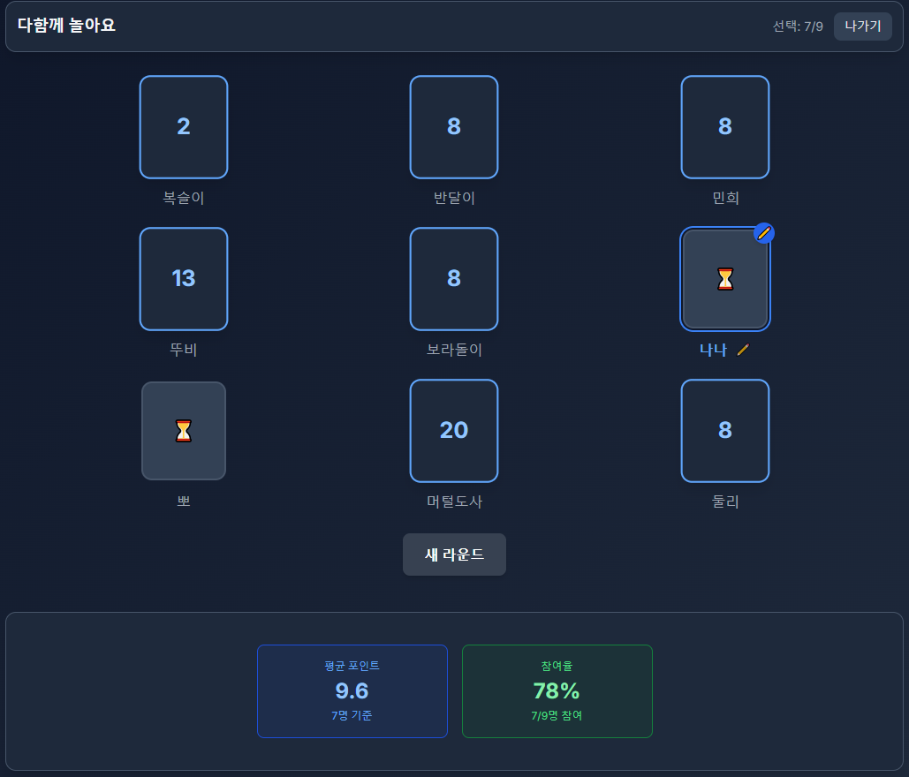

# 복슬 플래닝 포커 (Boksl Planning Poker)

🎯 **웹 기반 애자일 스프린트 플래닝 도구**

**거의 모든 설계 및 코딩을 [Cursor AI](https://www.cursor.com/)를 이용해 만들었음**

## 1. 📋 프로젝트 개요

최소한의 기능을 가진 실시간 플래닝 포커 웹 애플리케이션입니다.
- 🚀 **간단한 설정**: 로그인 없이 바로 사용 가능
- 🔄 **실시간 동기화**: 웹소켓 기반 실시간 카드 선택 및 결과 공유
- 📱 **반응형 디자인**: 모바일, 태블릿, 데스크톱 모든 기기 지원
- 🌓 **다크모드 지원**: 라이트/다크 테마 자동 전환 및 수동 토글

## 2. ✨ 주요 기능

- **방 생성/입장**: 방 이름으로 간단하게 생성 및 입장
- **카드 선택**: 피보나치 수열 기반 포인트 카드 (0, 1/2, 1, 2, 3, 5, 8, 13, 20, 40, 60, 100, ?, 커피)
- **실시간 동기화**: 모든 참여자의 선택 상태 실시간 표시
- **자동 평균 계산**: 숫자 카드만으로 평균값 자동 계산
- **라운드 관리**: 새로운 스토리를 위한 카드 리셋
- **테마 지원**: 라이트/다크 모드 지원 및 시스템 설정 자동 감지
- **바둑판식 레이아웃**: 참여자가 많아도 깔끔한 카드 배치
- **접근성**: 키보드 네비게이션, 스크린 리더 지원

### 2.1. 스크린샷 
- 메인화면 


- 카드 선택 


- 결과 보기



## 3. 🛠 기술 스택

### 3.1. 백엔드
- **Node.js** + **TypeScript**
- **Express.js** - 웹 서버 프레임워크
- **Socket.io** - 실시간 웹소켓 통신

### 3.2. 프론트엔드
- **React 18** + **TypeScript**
- **Vite** - 빌드 도구
- **Tailwind CSS** - 스타일링 (다크모드 지원)
- **Socket.io-client** - 실시간 통신

### 3.3. 개발 환경
- **WSL2 Ubuntu** - 윈도우에서 Linux 개발 환경
- **Docker** - 컨테이너화 (WSL2 백엔드)
- **VSCode Remote-WSL** - 통합 개발 환경

### 3.4. 배포
- **Docker** - 컨테이너화

## 4. 🚀 빠른 시작


### 4.1. 로컬 개발 환경 (WSL)

```bash
# 1. 의존성 설치
# 서버
cd server
npm install
cd ..

# 클라이언트  
cd client
npm install
cd ..

# 2. 개발 서버 실행
# 서버 (터미널 1)
cd server
npm run dev

# 클라이언트 (터미널 2)
cd client
npm run dev
```

### 4.2. 프로덕션 빌드

```bash
# 클라이언트 빌드
cd client
npm run build
cd ..

# 서버 빌드
cd server
npm run build

# 프로덕션 서버 실행
npm start
```

### 4.3. Docker를 이용한 빌드 및 실행

```bash
# 🐳 Docker 프로덕션 빌드
docker build -t boksl-planning-poker .

# 또는 빌드 스크립트 사용
./scripts/build.sh

# 🚀 Docker 컨테이너 실행
docker run -p 3000:3000 boksl-planning-poker

# 💡 포트 변경이 필요한 경우
docker run -p 8080:3000 boksl-planning-poker

# 📦 Docker Compose를 이용한 실행
docker-compose up

# 🛠️  Docker 개발 환경 (별도 스크립트)
./scripts/dev.sh

# 🔍 컨테이너 상태 확인
docker-compose ps

# 📜 로그 확인
docker-compose logs -f

# 🧹 정리
docker-compose down
```

### 4.4. 개발 도구 및 스크립트

```bash
# 타입 검사
cd client && npm run type-check && cd ..
cd server && npm run type-check && cd ..

# 코드 품질 검사 (ESLint)
cd client && npm run lint && cd ..
cd server && npm run lint && cd ..

# 전체 프로젝트 빌드 (한 번에)
(cd client && npm run build) && (cd server && npm run build)

# 전체 설치 및 빌드 (처음 설정 시)
(cd client && npm install && npm run build) && (cd server && npm install && npm run build)
```

## 5. 📁 프로젝트 구조

```
BokslPlanningPoker/
├── server/          # 백엔드 (Express + Socket.io)
│   ├── src/
│   │   ├── index.ts       # 서버 엔트리포인트
│   │   ├── socket/        # Socket.io 이벤트 핸들러
│   │   ├── models/        # 데이터 모델 (User, Room, Game)
│   │   └── utils/         # 유틸리티 함수
│   └── package.json
├── client/          # 프론트엔드 (React + Vite)
│   ├── src/
│   │   ├── App.tsx        # 메인 애플리케이션
│   │   ├── components/    # React 컴포넌트
│   │   ├── hooks/         # 커스텀 훅 (useSocket, useGame, useTheme)
│   │   ├── types/         # 클라이언트 타입
│   │   └── styles/        # 글로벌 스타일 (다크모드 포함)
│   ├── package.json
│   ├── vite.config.ts
│   └── tailwind.config.js # 다크모드 설정 포함
├── shared/          # 공통 타입 및 상수
│   ├── types.ts           # 데이터 타입 정의
│   ├── socket-events.ts   # Socket.io 이벤트 정의
│   ├── constants.ts       # 게임 설정 상수
│   └── index.ts           # 통합 export
├── scripts/         # 빌드 및 배포 스크립트
│   ├── build.sh           # Docker 빌드 스크립트
│   ├── dev.sh             # 개발 환경 실행 스크립트
│   ├── deploy-dockerhub.sh # Docker Hub 온라인 배포 스크립트
│   ├── deploy-offline.sh  # 오프라인 배포 패키지 생성 스크립트
│   ├── install-docker.sh  # Linux 서버 Docker 설치 스크립트
│   └── check-docker.sh    # Docker 환경 확인 스크립트
├── docs/            # 프로젝트 문서
├── Dockerfile       # Docker 빌드 설정
├── docker-compose.yml     # Docker Compose 설정 (개발/프로덕션)
├── docker-compose.offline.yml # 오프라인 배포용 설정
├── healthcheck.js   # 컨테이너 헬스체크
└── .dockerignore    # Docker 빌드 제외 파일
```

## 6. 🐳 Docker 배포

### 6.0. Docker 설정

#### **A. WSL2 환경 (개발용)**

**WSL2에서 Docker 명령어가 인식되지 않는 경우:**

1. **Docker Desktop WSL 통합 활성화 (권장)**
   ```
   1. Windows에서 Docker Desktop 실행
   2. Settings → Resources → WSL Integration
   3. ✅ Enable integration with my default WSL distro
   4. ✅ 사용 중인 WSL 배포판 (Ubuntu 등) 체크
   5. 🔄 Apply & Restart
   ```

2. **WSL 재시작 후 확인**
   ```bash
   # 새 터미널에서 확인
   docker --version
   docker-compose --version
   
   # Docker 환경 확인 스크립트 실행
   ./scripts/check-docker.sh
   ```

#### **B. Linux 서버 환경 (배포용)**

**원격 Ubuntu 서버에 Docker 설치:**

1. **자동 설치 스크립트 사용 (권장)**
   ```bash
   # 스크립트를 서버로 전송
   scp scripts/install-docker.sh user@server:~/
   
   # 서버에서 실행
   ssh user@server
   chmod +x install-docker.sh
   ./install-docker.sh
   ```

2. **수동 설치 (빠른 방법)**
   ```bash
   # 시스템 업데이트
   sudo apt update
   
   # Docker 공식 설치 스크립트
   curl -fsSL https://get.docker.com -o get-docker.sh
   sudo sh get-docker.sh
   
   # 사용자 권한 설정
   sudo usermod -aG docker $USER
   newgrp docker
   
   # 설치 확인
   docker --version
   docker run hello-world
   ```

3. **APT 패키지 매니저 사용**
   ```bash
   sudo apt update
   sudo apt install -y docker.io docker-compose
   sudo systemctl start docker
   sudo systemctl enable docker
   sudo usermod -aG docker $USER
   newgrp docker
   ```

#### **C. sudo 권한 관리**

**Docker 설치 후 sudo 없이 사용하기:**

```bash
# 문제: sudo가 필요함
sudo docker run hello-world  # ✅ 작동
docker run hello-world       # ❌ 권한 오류

# 해결: docker 그룹에 사용자 추가
sudo usermod -aG docker $USER

# 권한 적용 (다음 중 하나 선택)
newgrp docker                # 1️⃣ 즉시 적용
# 또는 새 터미널 열기        # 2️⃣ 터미널 재시작  
# 또는 재로그인             # 3️⃣ SSH 재접속

# 확인
docker run hello-world       # ✅ sudo 없이 작동
groups                       # docker 그룹 포함 확인
```

### 6.1. 프로덕션 배포 (인터넷 연결 환경)

#### **A. 로컬 빌드 방식**

```bash
# 1. Docker 이미지 빌드
docker build -t boksl-planning-poker .

# 2. 컨테이너 실행
docker run -d \
  --name planning-poker \
  -p 3000:3000 \
  --restart unless-stopped \
  boksl-planning-poker

# 3. 또는 Docker Compose 사용
docker-compose up -d
```

#### **B. Docker Hub 방식 (권장)**

```bash
# 1. Docker Hub 로그인
docker login

# 2. 자동화 스크립트로 빌드 및 업로드
./scripts/deploy-dockerhub.sh YOUR_DOCKERHUB_USERNAME v1.0.0

# 3. 원격 서버에서 바로 실행
docker run -d -p 3000:3000 --name planning-poker YOUR_DOCKERHUB_USERNAME/boksl-planning-poker:v1.0.0

# 4. 또는 생성된 배포 스크립트 사용
scp deploy-to-server.sh user@server:~/
ssh user@server './deploy-to-server.sh'
```

### 6.2. 오프라인 배포

**Docker Hub 없이 배포하는 방법:**

#### **A. 자동화 스크립트 사용 (권장)**

```bash
# 1. 배포 패키지 생성
./scripts/deploy-offline.sh v1.0.0

# 2. docker-images/ 폴더를 대상 서버로 전송
scp -r docker-images/ user@offline-server:/opt/planning-poker/

# 3. 대상 서버에서 설치 실행
ssh user@offline-server 'cd /opt/planning-poker && ./install.sh'
```

#### **B. 수동 배포**

```bash
# 1. 로컬에서 이미지 빌드 및 저장
docker build -t boksl-planning-poker:v1.0.0 .
docker save -o planning-poker.tar boksl-planning-poker:v1.0.0
gzip planning-poker.tar

# 2. 파일 전송 (USB, scp, 물리적 매체 등)
scp planning-poker.tar.gz user@offline-server:/tmp/

# 3. 대상 서버에서 이미지 로드 및 실행
ssh user@offline-server
gunzip -c /tmp/planning-poker.tar.gz | docker load
docker run -d -p 3000:3000 --name planning-poker boksl-planning-poker:v1.0.0
```

#### **C. USB 드라이브 활용**

```bash
# 1. USB 마운트 후 이미지 저장
mount /dev/sdb1 /media/usb
docker save boksl-planning-poker:v1.0.0 | gzip > /media/usb/planning-poker.tar.gz

# 2. 대상 서버에서 USB 마운트 후 로드
mount /dev/sdb1 /media/usb
gunzip -c /media/usb/planning-poker.tar.gz | docker load
```

### 6.3. 개발 환경

```bash
# 개발 환경 실행 (핫 리로드 지원)
./scripts/dev.sh

# 수동 실행
docker-compose --profile dev up --build
```

### 6.4. 모니터링

```bash
# 컨테이너 상태 확인
docker ps

# 로그 확인
docker logs planning-poker

# 컨테이너 접속
docker exec -it planning-poker sh

# 리소스 사용량 확인
docker stats planning-poker
```

### 6.5. nginx + SSL 설정 (프로덕션 환경)

**🎯 목적**: nginx 리버스 프록시와 Let's Encrypt SSL 인증서를 통한 HTTPS 서비스 제공

#### **A. 자동 nginx + SSL 설정**

```bash
# 1. 도메인과 이메일로 자동 설정
./scripts/setup-nginx-ssl.sh your-domain.com admin@your-domain.com

# 예시
./scripts/setup-nginx-ssl.sh poker.example.com webmaster@example.com
```

**📋 setup-nginx-ssl.sh가 자동으로 수행하는 작업**:

1. **nginx 설치 및 리버스 프록시 설정**
   - Docker 컨테이너(`localhost:3000`)로 프록시 연결
   - 웹소켓(Socket.io) 지원 설정

2. **Let's Encrypt SSL 인증서 발급**
   - 무료 SSL 인증서 자동 발급
   - nginx SSL 설정 자동 적용

3. **보안 설정**
   - HTTP → HTTPS 자동 리다이렉트
   - 보안 헤더 추가 (HSTS, XSS 보호 등)

4. **방화벽 및 자동 갱신 설정**
   - nginx 포트 허용 (80, 443)
   - SSL 인증서 자동 갱신 cron 설정

#### **B. SSL 인증서 자동 갱신**

```bash
# 수동 갱신 테스트
sudo certbot renew --dry-run

# 갱신 로그 확인
./scripts/ssl-auto-renew.sh
```

**📋 ssl-auto-renew.sh 기능**:

- **인증서 만료일 확인**: 현재 및 갱신 후 만료일 로깅
- **자동 갱신 실행**: certbot으로 인증서 갱신
- **서비스 재시작**: nginx 설정 검증 및 재로드
- **상태 확인**: Docker 컨테이너 및 HTTPS 접근 테스트
- **로그 기록**: `/var/log/ssl-renew.log`에 상세 로그 저장

#### **C. 아키텍처 구조**

```
인터넷 → nginx (SSL 터미네이션) → Docker 컨테이너 (복슬 플래닝 포커)
         ↓
    80 → 443 리다이렉트 (HTTP → HTTPS)
    443 → localhost:3000 프록시 (nginx → Docker)
```

**🌐 트래픽 흐름**:
1. 사용자가 `https://your-domain.com` 접속
2. nginx가 SSL 암호화/복호화 처리
3. nginx가 `localhost:3000`으로 프록시 (Docker 컨테이너)
4. Docker에서 실행 중인 복슬 플래닝 포커 앱이 응답

#### **D. 수동 설정 (고급 사용자용)**

**1. nginx 설정 파일 위치**:
```bash
# 설정 파일
/etc/nginx/sites-available/your-domain.com
/etc/nginx/sites-enabled/your-domain.com

# 설정 테스트
sudo nginx -t

# 재로드
sudo systemctl reload nginx
```

**2. SSL 인증서 관리**:
```bash
# 인증서 상태 확인
sudo certbot certificates

# 수동 갱신
sudo certbot renew

# 특정 도메인 갱신
sudo certbot renew --cert-name your-domain.com
```

**3. 로그 확인**:
```bash
# nginx 접근 로그
sudo tail -f /var/log/nginx/access.log

# nginx 에러 로그
sudo tail -f /var/log/nginx/error.log

# SSL 갱신 로그
sudo tail -f /var/log/ssl-renew.log
```

#### **E. 문제 해결**

**일반적인 문제들**:

1. **도메인 DNS 설정**
   ```bash
   # 도메인이 서버 IP를 가리키는지 확인
   nslookup your-domain.com
   dig your-domain.com
   ```

2. **방화벽 설정**
   ```bash
   # 포트 80, 443 열기
   sudo ufw allow 'Nginx Full'
   sudo ufw status
   ```

3. **SSL 인증서 발급 실패**
   ```bash
   # 수동으로 인증서 발급 시도
   sudo certbot --nginx -d your-domain.com --verbose
   ```

4. **Docker 컨테이너 연결 확인**
   ```bash
   # 3000 포트에서 앱이 실행 중인지 확인
   curl http://localhost:3000
   docker ps | grep planning-poker
   ```

## 7. 📖 문서

- [기능 요구사항](./docs/기능요구사항.md)
- [기술 스택 상세](./docs/기술스택.md)
- [구현 단계](./docs/구현단계.md)

## 8. 🤝 지원

문제가 있거나 기능 제안이 있으시면 [Issues](../../issues)를 열어주세요.

---

⭐ 이 프로젝트가 도움이 되었다면 스타를 눌러주세요! 